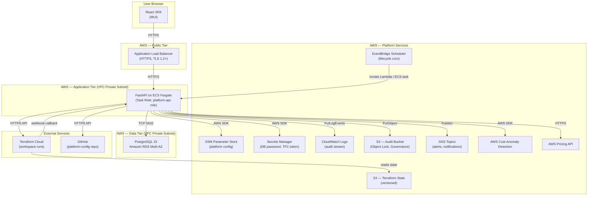
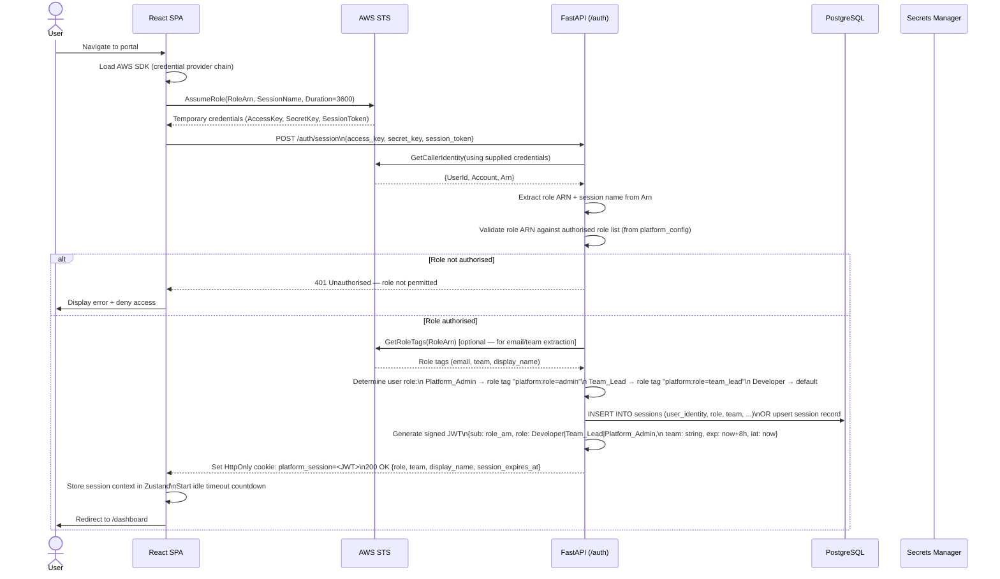
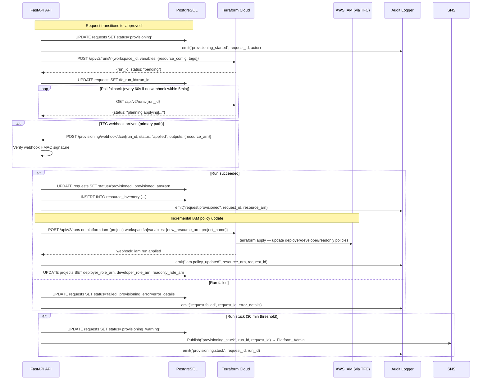
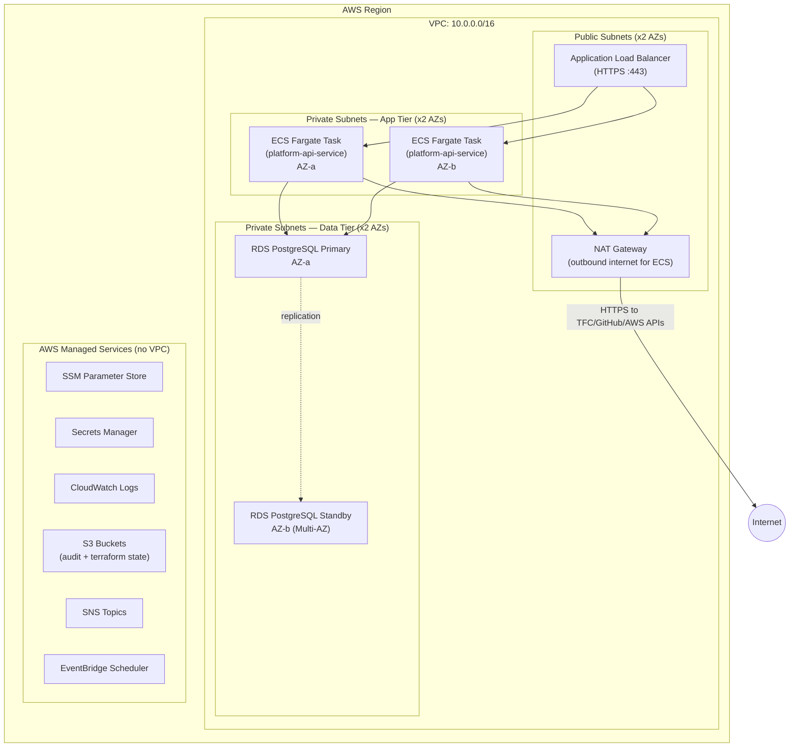

# Design Document: AWS Developer Platform

## Overview

The AWS Developer Platform is an internal self-service portal that enables developers to provision AWS resources (S3 buckets, Lambda functions, DynamoDB tables) through a governed web UI. The platform enforces naming conventions, required tagging, guardrail policies, budget and quota limits, and an approval workflow before invoking Terraform Cloud to create resources. It also manages IAM scaffolding per project, resource lifecycle enforcement, cost monitoring, and a tamper-proof audit trail.

The system is a proof-of-concept (POC) targeting up to 50 concurrent internal users. The architecture prioritises operational simplicity, auditability, and security over hyper-scale.

**Technology stack (decided prior to design):**
- **Frontend**: React SPA with MUI (Material UI) component library
- **Backend API**: FastAPI (Python 3.12) on Amazon ECS Fargate
- **Application database**: PostgreSQL 15 on Amazon RDS (Multi-AZ for resilience)
- **Config repo**: GitHub (`platform-config` repository)
- **Infrastructure provisioning**: Terraform Cloud
- **Audit storage**: Dual-write — Amazon CloudWatch Logs + Amazon S3 with Object Lock (Governance mode)
- **Secrets**: AWS SSM Parameter Store (config) + AWS Secrets Manager (runtime secrets)
- **Notifications**: Amazon SNS → email subscriptions
- **Scheduling**: Amazon EventBridge Scheduler
- **Cost monitoring**: AWS Cost Anomaly Detection
- **Pricing estimates**: AWS Pricing API


---

## Architecture

### High-Level Component Diagram




---

## Components and Interfaces

### 1. React SPA (Portal UI)

The frontend is a single-page application served from S3/CloudFront (or directly from the ALB as a static asset from ECS). MUI v5 is used for the component library.

**Key pages and routes:**

| Route | Component | Roles |
|---|---|---|
| `/login` | IAM Role assumption / STS flow | All |
| `/dashboard` | Personal request list + status | Developer, Team_Lead |
| `/requests/new` | Multi-step resource request form | Developer, Team_Lead |
| `/requests/:id` | Request detail + audit trail | Developer, Team_Lead, Platform_Admin |
| `/approvals` | Approval queue | Team_Lead |
| `/projects` | Project catalogue | Team_Lead, Platform_Admin |
| `/projects/new` | Project registration form | Team_Lead |
| `/projects/:id` | Project detail + IAM ARNs | Team_Lead, Platform_Admin |
| `/admin` | Platform administration (dropdowns, guardrails) | Platform_Admin |
| `/admin/audit` | Audit log viewer | Platform_Admin |
| `/admin/cost` | Cost anomaly dashboard | Platform_Admin |

**State management:** React Query (TanStack Query v5) for server state (request lists, project data, guardrail results). Zustand for local UI state (form wizard step, session context). No Redux — the app is simple enough that these lightweight options avoid boilerplate.

**Key design patterns:**
- Multi-step wizard for resource request form (resource type → configuration → cost estimate + guardrail review → submit)
- Real-time cost estimate updates via debounced API calls as form fields change
- Role-based conditional rendering — UI components check the session role context to show/hide actions
- Session timeout warning modal driven by a countdown timer in Zustand store
- Guardrail warning acknowledgement: each warning rendered as a checkbox; form cannot proceed until all are checked


### 2. FastAPI Backend

**Module structure:**

```
app/
├── main.py                  # FastAPI app init, middleware registration, router inclusion
├── config.py                # Settings loaded from SSM Parameter Store at startup
├── db/
│   ├── session.py           # SQLAlchemy async engine + session factory
│   └── models.py            # ORM models (mapped to PostgreSQL tables)
├── routers/
│   ├── auth.py              # /auth — STS GetCallerIdentity, session creation
│   ├── requests.py          # /requests — CRUD, status transitions
│   ├── projects.py          # /projects — project registration, IAM scaffolding
│   ├── approvals.py         # /approvals — approval queue, approve/reject actions
│   ├── admin.py             # /admin — dropdown management, guardrail config
│   ├── provisioning.py      # /provisioning — TFC webhook callbacks, status polling
│   ├── audit.py             # /audit — audit log query (admin-only)
│   └── cost.py              # /cost — pricing API proxy, anomaly data
├── services/
│   ├── guardrail_engine.py  # Rule loading, evaluation, warning generation
│   ├── provisioner.py       # Terraform Cloud API client
│   ├── audit_logger.py      # Dual-write audit event emitter
│   ├── lifecycle.py         # Expiry checks, deprovision triggers
│   ├── config_sync.py       # GitHub Config_Repo reader/cache refresher
│   ├── cost_estimator.py    # AWS Pricing API wrapper
│   └── iam_policy.py        # IAM policy document builder for deployer roles
├── middleware/
│   ├── rate_limiter.py      # Sliding window rate limiting (Redis-backed or in-memory)
│   ├── session.py           # JWT session validation, role injection into request context
│   └── audit_middleware.py  # Automatic audit event emission on state-changing routes
├── schemas/
│   ├── requests.py          # Pydantic v2 models for request create/update/response
│   ├── projects.py          # Pydantic v2 models for project registration
│   └── audit.py             # Pydantic v2 models for audit events
└── utils/
    ├── naming.py            # Naming convention validators (S3, Lambda, DynamoDB)
    └── tags.py              # Required tag validation helpers
```

**Key routers:**

- `auth.py`: Accepts an IAM session token from the frontend (obtained after the user calls `sts:AssumeRole` in the browser via AWS SDK). Calls `sts:GetCallerIdentity` server-side to verify the token. Extracts role ARN, session name, and role tags. Creates a signed JWT and sets it as an `HttpOnly` cookie.
- `requests.py`: Handles request creation (validation → guardrail evaluation → cost estimate → persist), status queries, and manual status transitions (Developer acknowledgement of warnings).
- `provisioning.py`: Receives Terraform Cloud webhook callbacks (HMAC-verified). Updates request status based on run outcome. Triggers IAM policy updates post-provision.
- `admin.py`: CRUD for `platform_config` table. Commits config changes to the Config_Repo via GitHub API (automated PR on save).

**Middleware stack (applied in order):**

1. `TrustedHostMiddleware` — rejects requests with invalid Host headers
2. `HTTPSRedirectMiddleware` — redirects HTTP to HTTPS (in production)
3. `session.py` — validates JWT cookie, injects `request.state.user` (identity, role, team)
4. `rate_limiter.py` — per-user and global sliding-window rate limiting; returns 429 on breach
5. `audit_middleware.py` — on state-changing requests (POST/PATCH/DELETE), emits an audit event after response is sent (using FastAPI background tasks)


### 3. Guardrail Engine

The Guardrail Engine is a pluggable rule evaluation system that checks resource request configurations against defined policy rules.

**Architecture:**

```
GuardrailEngine
├── load_rules(resource_type, config_cache) → List[GuardrailRule]
├── evaluate(request: ResourceRequest) → List[GuardrailWarning]
└── rules/
    ├── base.py          # Abstract GuardrailRule: id, name, description, evaluate(request) → Warning | None
    ├── s3_rules.py      # S3-G1 through S3-G5 implementations
    ├── lambda_rules.py  # L-G1 through L-G7 implementations
    └── dynamodb_rules.py# D-G1 through D-G6 implementations
```

**Rule interface contract:**

```python
class GuardrailRule(ABC):
    rule_id: str           # e.g. "S3-G1"
    name: str              # human-readable rule name
    description: str       # what the rule checks
    resource_type: str     # "s3" | "lambda" | "dynamodb"
    enabled: bool          # loaded from platform_config / Config_Repo

    @abstractmethod
    def evaluate(self, request: ResourceRequest) -> Optional[GuardrailWarning]:
        """Returns a GuardrailWarning if the rule is violated, None if satisfied."""
        ...
```

**Rule loading:** At startup and after each Config_Repo sync, the engine reads the `guardrails/` directory from the Config_Repo. Each YAML file defines the rule's enabled state and any configurable thresholds (e.g., memory limit for L-G1). The Python rule classes are loaded from `services/guardrail_engine.py`; the YAML provides only configuration/toggle data, not logic. This means guardrail logic changes require a code deployment, but toggling rules on/off and adjusting thresholds does not.

**Evaluation flow:**
1. Load all rules for the request's resource type where `enabled = true`
2. Call `rule.evaluate(request)` for each rule in sequence
3. Collect all non-None warnings
4. Return the full list of `GuardrailWarning` objects (each containing `rule_id`, `rule_name`, `message`, `remediation`)


### 4. Provisioner Service

The Provisioner Service is responsible for invoking Terraform Cloud, polling/receiving run status, updating IAM policies incrementally, and recording provisioning outcomes.

**Terraform Cloud API integration:**

- Uses the TFC Runs API (`POST /api/v2/runs`) to create a new run in the appropriate workspace
- Workspace naming convention: `platform-{resource_type}-{project_name}` (e.g., `platform-s3-myproject`)
- One workspace per resource type per project; all S3 resources for a project share a workspace, allowing the Terraform state to track all bucket resources together
- Variables are passed as a `variables` payload on the run (not workspace-level variables, to keep runs self-contained)
- The TFC API token is stored in AWS Secrets Manager; fetched at service startup

**Polling vs. callbacks:**

- Terraform Cloud supports both polling (GET run status) and webhooks (notification configuration)
- Design uses **webhooks as primary, polling as fallback**:
  - TFC sends a webhook POST to `POST /provisioning/webhook/tfc` on run completion (apply/error/cancelled)
  - If a run has not produced a webhook within 5 minutes, a background task polls TFC every 60 seconds
  - After 30 minutes with no terminal state, the run is marked `stuck` and SNS alert is sent (per NFR-7.4)

**IAM policy incremental updates:**

After a successful provisioning run:
1. Provisioner fetches the new resource ARN from TFC run outputs
2. Calls `iam_policy.py` to generate an updated IAM policy document for the project's `-deployer`, `-developer`, and `-readonly` roles
3. Triggers a TFC run on the project's IAM workspace (`platform-iam-{project_name}`) to apply the updated policy
4. Records the policy update as an IAM audit event

**Deployer role creation at project registration:**

Project registration triggers a TFC run on a dedicated IAM workspace for the project. The initial deployer policy has an `Effect: Allow` on the relevant actions with a placeholder condition (`aws:RequestedRegion` = project's region) until real ARNs are available. This avoids creating an overly permissive wildcard policy.


### 5. Audit Logger

The Audit Logger implements the dual-write pattern: every audit event is written atomically to both CloudWatch Logs and S3.

**Dual-write implementation:**

```python
class AuditLogger:
    async def emit(self, event: AuditEvent) -> None:
        json_payload = event.model_dump_json()
        # Fire both writes concurrently; treat partial failure as an error
        results = await asyncio.gather(
            self._write_cloudwatch(json_payload),
            self._write_s3(json_payload),
            return_exceptions=True
        )
        for result in results:
            if isinstance(result, Exception):
                # Log the failure to a fallback local logger; do not suppress
                logger.error("AuditLogger write failure: %s", result)
                raise AuditWriteError(f"Audit dual-write partially failed: {result}")
```

**CloudWatch target:** Log group `/platform/audit`, log stream per day (`YYYY-MM-DD`). Uses `boto3` PutLogEvents API in batched mode (up to 10,000 events per batch).

**S3 target:** Bucket `platform-audit-{account_id}`. Object key pattern: `audit/{year}/{month}/{day}/{event_id}.json`. Each event is a separate object (not concatenated) to preserve Object Lock per-object semantics. Object Lock retention: 90 days (Governance mode).

**Structured event schema** (`AuditEvent` Pydantic model):

```json
{
  "event_id": "uuid4",
  "event_type": "request.submitted | request.approved | ...",
  "event_category": "request | admin | iam | security | cost | lifecycle",
  "request_id": "uuid4 | null",
  "project_name": "string | null",
  "actor_identity": "arn:aws:sts::123456789012:assumed-role/dev-role/session",
  "action": "string",
  "resource_arn": "string | null",
  "timestamp": "2025-01-01T10:00:00Z",
  "source_ip": "string",
  "additional_context": {}
}
```


### 6. Lifecycle Scheduler

The Lifecycle Scheduler enforces expiry date lifecycle rules for provisioned resources.

**Trigger mechanism:** An Amazon EventBridge Scheduler rule runs a scheduled ECS task (or invokes a Lambda function calling the FastAPI lifecycle endpoint) once daily at 01:00 UTC. This avoids the need for a persistent scheduler process inside the ECS task.

**EventBridge → FastAPI flow:**
1. EventBridge fires at 01:00 UTC
2. Triggers an ECS task with the `LIFECYCLE_RUN=true` environment variable (or calls an internal API endpoint protected by an API key in SSM)
3. FastAPI `lifecycle.py` service queries the `resource_inventory` table for resources whose expiry milestones fall on the current date
4. For each matching resource, emits the appropriate notification/status transition

**Notification delivery:** SNS topic `platform-lifecycle-notifications` → email subscriptions (resource owner + team lead). Emails are templated in the service (not SES templates, to keep dependencies minimal for POC).

**Deprovision trigger:** If auto-deprovision is enabled, the scheduler calls the Provisioner Service to trigger a TFC deprovision run (using a `terraform destroy` workspace run with `-target` on the specific resource).

### 7. Config Sync

The platform reads configuration from the GitHub `platform-config` repository and caches it in the `platform_config` PostgreSQL table.

**Sync mechanism:**

- **Primary: GitHub webhook on merge** — when a PR is merged to the `main` branch of `platform-config`, GitHub sends a `push` event to `POST /admin/config/sync`. The FastAPI handler pulls the updated YAML files, updates the `platform_config` table, and invalidates any in-memory caches.
- **Fallback: polling** — a background task polls the GitHub API for the latest commit SHA every 5 minutes. If the SHA differs from the cached version, a sync is triggered. This covers cases where a webhook delivery fails.
- **Startup sync** — on FastAPI startup, a full sync is performed to ensure the cache is current.

**Config structure read by sync:**

The sync service reads these directories from the repo and upserts their content into `platform_config`:
- `guardrails/` → guardrail rule enabled states and thresholds
- `dropdowns/` → allowed values for `cost_center`, `environment`
- `quotas/` → per-project resource quotas
- `budgets/` → per-project budget limits
- `rate_limits/` → rate limiting thresholds
- `lifecycle/` → expiry lifecycle parameters
- `security/` → security alert thresholds


---

## Data Models

### PostgreSQL Schema

All tables use `uuid` primary keys (generated with `gen_random_uuid()`). All timestamps are stored in UTC.

---

#### `projects` table

Stores project registration data, IAM role ARNs, budget, quotas, and project status.

```sql
CREATE TABLE projects (
    id                  UUID PRIMARY KEY DEFAULT gen_random_uuid(),
    name                VARCHAR(32)  NOT NULL UNIQUE,   -- alphanumeric + hyphens, max 32 chars
    description         TEXT,
    application_name    VARCHAR(128) NOT NULL,
    team_name           VARCHAR(128) NOT NULL,
    cost_center         VARCHAR(64)  NOT NULL,
    default_owner       VARCHAR(256) NOT NULL,          -- IAM session principal of registering Team_Lead
    allowed_environments TEXT[]      NOT NULL DEFAULT '{"dev","uat"}',
    allowed_resource_types TEXT[]    NOT NULL DEFAULT '{"s3","lambda","dynamodb"}',
    monthly_budget_usd  NUMERIC(10,2) NOT NULL DEFAULT 100.00,
    -- IAM role ARNs (populated after provisioning)
    deployer_role_arn   VARCHAR(512),
    developer_role_arn  VARCHAR(512),
    readonly_role_arn   VARCHAR(512),
    -- Status
    status              VARCHAR(32)  NOT NULL DEFAULT 'active',
                        -- 'active' | 'iam_failed' | 'deactivated'
    iam_error_details   TEXT,
    -- Audit
    registered_by       VARCHAR(512) NOT NULL,          -- IAM session principal
    registered_at       TIMESTAMPTZ  NOT NULL DEFAULT now(),
    updated_at          TIMESTAMPTZ  NOT NULL DEFAULT now(),
    -- Tags applied to IAM roles
    tags                JSONB        NOT NULL DEFAULT '{}'
);

CREATE INDEX idx_projects_name ON projects(name);
CREATE INDEX idx_projects_status ON projects(status);
```


---

#### `requests` table

Stores all resource request fields, status, guardrail warnings, cost estimates, and approval history.

```sql
CREATE TABLE requests (
    id                  UUID PRIMARY KEY DEFAULT gen_random_uuid(),
    project_id          UUID NOT NULL REFERENCES projects(id),
    resource_type       VARCHAR(16) NOT NULL,  -- 's3' | 'lambda' | 'dynamodb'
    resource_name       VARCHAR(512) NOT NULL, -- fully constructed resource name
    region              VARCHAR(32) NOT NULL,
    environment         VARCHAR(16) NOT NULL,
    -- Resource-specific configuration (varies by type)
    resource_config     JSONB NOT NULL DEFAULT '{}',
    -- Required tags
    tags                JSONB NOT NULL DEFAULT '{}',
    -- Status lifecycle
    status              VARCHAR(32) NOT NULL DEFAULT 'pending',
                        -- pending | guardrail_review | budget_review | quota_review
                        -- approval_pending | approved | rejected
                        -- provisioning | provisioned | failed | expired
                        -- expiry_pending | deprovisioned | deprovision_failed
    -- Guardrail evaluation
    guardrail_warnings  JSONB NOT NULL DEFAULT '[]',  -- array of {rule_id, message, remediation}
    guardrail_acknowledged_at TIMESTAMPTZ,
    guardrail_acknowledged_by VARCHAR(512),
    -- Cost estimation
    estimated_monthly_cost_usd NUMERIC(10,4),
    cost_estimate_generated_at TIMESTAMPTZ,
    -- Budget exception
    budget_justification TEXT,
    budget_exception_reviewed_by VARCHAR(512),
    budget_exception_reviewed_at TIMESTAMPTZ,
    budget_exception_outcome VARCHAR(16),      -- 'approved' | 'denied'
    -- Quota exception
    quota_justification TEXT,
    quota_exception_reviewed_by VARCHAR(512),
    quota_exception_reviewed_at TIMESTAMPTZ,
    quota_exception_outcome VARCHAR(16),       -- 'approved' | 'denied'
    -- Approval
    submitted_by        VARCHAR(512) NOT NULL,  -- IAM session principal
    approved_by         VARCHAR(512),
    approved_at         TIMESTAMPTZ,
    rejected_by         VARCHAR(512),
    rejected_at         TIMESTAMPTZ,
    rejection_reason    TEXT,
    -- Provisioning
    tfc_run_id          VARCHAR(256),
    tfc_workspace_id    VARCHAR(256),
    provisioned_arn     VARCHAR(512),
    provisioned_at      TIMESTAMPTZ,
    provisioning_error  TEXT,
    -- Expiry
    expiry_date         DATE NOT NULL,
    -- Audit
    created_at          TIMESTAMPTZ NOT NULL DEFAULT now(),
    updated_at          TIMESTAMPTZ NOT NULL DEFAULT now()
);

CREATE INDEX idx_requests_project_id ON requests(project_id);
CREATE INDEX idx_requests_status ON requests(status);
CREATE INDEX idx_requests_submitted_by ON requests(submitted_by);
CREATE INDEX idx_requests_expiry_date ON requests(expiry_date);
CREATE INDEX idx_requests_created_at ON requests(created_at);
```


---

#### `audit_events` table

Mirrors the structured events written to CloudWatch Logs and S3. Provides queryable audit history within the portal.

```sql
CREATE TABLE audit_events (
    id                  UUID PRIMARY KEY DEFAULT gen_random_uuid(),
    event_type          VARCHAR(64) NOT NULL,
                        -- e.g. 'request.submitted', 'request.approved', 'iam.policy_updated'
    event_category      VARCHAR(32) NOT NULL,
                        -- 'request' | 'admin' | 'iam' | 'security' | 'cost' | 'lifecycle'
    request_id          UUID REFERENCES requests(id),
    project_name        VARCHAR(32),
    actor_identity      VARCHAR(512) NOT NULL,  -- IAM session principal ARN
    action              VARCHAR(128) NOT NULL,
    resource_arn        VARCHAR(512),
    timestamp           TIMESTAMPTZ NOT NULL,
    source_ip           INET,
    additional_context  JSONB NOT NULL DEFAULT '{}',
    -- Retention: records retained >= 12 months (per NFR-7.5)
    created_at          TIMESTAMPTZ NOT NULL DEFAULT now()
);

CREATE INDEX idx_audit_events_request_id ON audit_events(request_id);
CREATE INDEX idx_audit_events_event_category ON audit_events(event_category);
CREATE INDEX idx_audit_events_actor_identity ON audit_events(actor_identity);
CREATE INDEX idx_audit_events_timestamp ON audit_events(timestamp DESC);
CREATE INDEX idx_audit_events_project_name ON audit_events(project_name);
```

---

#### `platform_config` table

Caches configuration values sourced from the Config_Repo. Keyed by `config_key` within a `config_type` namespace.

```sql
CREATE TABLE platform_config (
    id              UUID PRIMARY KEY DEFAULT gen_random_uuid(),
    config_type     VARCHAR(64) NOT NULL,   -- 'dropdown' | 'guardrail' | 'quota' | 'budget'
                                            -- 'rate_limit' | 'lifecycle' | 'security'
    config_key      VARCHAR(128) NOT NULL,
    config_value    JSONB NOT NULL,
    -- Source tracking
    source_repo     VARCHAR(256) NOT NULL DEFAULT 'platform-config',
    source_path     VARCHAR(512) NOT NULL,  -- relative path in the repo
    source_commit   VARCHAR(64),            -- git SHA of last sync
    -- Audit
    synced_at       TIMESTAMPTZ NOT NULL DEFAULT now(),
    updated_by      VARCHAR(512),           -- actor who triggered the sync
    UNIQUE(config_type, config_key)
);

CREATE INDEX idx_platform_config_type ON platform_config(config_type);
```

**Example rows:**

| config_type | config_key | config_value |
|---|---|---|
| `dropdown` | `cost_center` | `["Engineering","Trading","Client Services","Compliance"]` |
| `guardrail` | `S3-G1` | `{"enabled": true, "name": "Public Access"}` |
| `quota` | `s3.per_project_per_env` | `10` |
| `lifecycle` | `expiry_warning_days_first` | `14` |
| `rate_limit` | `request_submission_per_minute` | `5` |


---

#### `resource_inventory` table

Tracks all provisioned resources per project, including expiry state and resource ARNs.

```sql
CREATE TABLE resource_inventory (
    id              UUID PRIMARY KEY DEFAULT gen_random_uuid(),
    request_id      UUID NOT NULL REFERENCES requests(id),
    project_id      UUID NOT NULL REFERENCES projects(id),
    resource_type   VARCHAR(16) NOT NULL,   -- 's3' | 'lambda' | 'dynamodb'
    resource_name   VARCHAR(512) NOT NULL,  -- fully constructed name
    resource_arn    VARCHAR(512) NOT NULL,
    region          VARCHAR(32) NOT NULL,
    environment     VARCHAR(16) NOT NULL,
    tags            JSONB NOT NULL DEFAULT '{}',
    -- Status
    status          VARCHAR(32) NOT NULL DEFAULT 'active',
                    -- 'active' | 'expiry_pending' | 'deprovisioned' | 'deprovision_failed'
    expiry_date     DATE NOT NULL,
    -- Lifecycle notification tracking
    warning_14d_sent_at    TIMESTAMPTZ,
    warning_7d_sent_at     TIMESTAMPTZ,
    expiry_notified_at     TIMESTAMPTZ,
    final_warning_sent_at  TIMESTAMPTZ,
    -- Deprovisioning
    deprovision_tfc_run_id VARCHAR(256),
    deprovisioned_at       TIMESTAMPTZ,
    deprovision_error      TEXT,
    -- Audit
    provisioned_at  TIMESTAMPTZ NOT NULL DEFAULT now(),
    updated_at      TIMESTAMPTZ NOT NULL DEFAULT now()
);

CREATE INDEX idx_resource_inventory_project_id ON resource_inventory(project_id);
CREATE INDEX idx_resource_inventory_status ON resource_inventory(status);
CREATE INDEX idx_resource_inventory_expiry_date ON resource_inventory(expiry_date);
CREATE INDEX idx_resource_inventory_resource_type ON resource_inventory(resource_type);
```


---

## IAM Authentication Flow

The portal uses an AWS STS-based authentication model. Users first assume an IAM role (via the AWS console, CLI, or a pre-configured identity provider), then present their temporary credentials to the portal, which validates them server-side.



**Session context stored in JWT claims:**

| Claim | Value |
|---|---|
| `sub` | IAM role ARN (e.g., `arn:aws:iam::123:role/dev-portal-developer`) |
| `session_name` | IAM session name (e.g., `alice@example.com`) |
| `role` | `Developer` \| `Team_Lead` \| `Platform_Admin` |
| `team` | Team name from role tag |
| `email` | Email from role tag (for notifications) |
| `iat` | Issued-at (UTC epoch) |
| `exp` | Expiry (UTC epoch, max 8 hours from iat) |

**Role determination:** The platform maps IAM role ARNs to portal roles via a `platform:role` tag on the IAM role itself. This avoids hardcoding ARNs in the platform config and allows new roles to be onboarded by adding the appropriate tag in IAM without a platform deployment.


---

## Request Lifecycle State Machine

```mermaid
stateDiagram-v2
    [*] --> pending : Developer submits request\n(all fields valid)

    pending --> guardrail_review : Guardrail engine\nattaches warnings
    pending --> approval_pending : No guardrail warnings

    guardrail_review --> approval_pending : Developer acknowledges\nall warnings

    approval_pending --> budget_review : Projected cost\nexceeds budget limit
    approval_pending --> quota_review : Resource count\nexceeds quota
    approval_pending --> approved : Approver approves\n(no budget/quota issues)
    approval_pending --> rejected : Approver rejects

    budget_review --> approval_pending : Team_Lead approves\nbudget exception
    budget_review --> rejected : Team_Lead denies\nbudget exception

    quota_review --> approval_pending : Team_Lead approves\nquota exception
    quota_review --> rejected : Team_Lead denies\nquota exception

    approval_pending --> expired : No action within 7 days

    approved --> provisioning : Provisioner triggers\nTerraform Cloud run

    provisioning --> provisioned : TFC run succeeds\nIAM policy updated
    provisioning --> failed : TFC run fails

    note right of failed : Developer can view\nerror details;\nTeam_Lead/Admin\ncan retry

    provisioned --> expiry_pending : expiry_date reached\n(lifecycle scheduler)

    expiry_pending --> provisioned : Team_Lead extends\nexpiry_date
    expiry_pending --> deprovisioned : Auto-deprovision\nrun succeeds (T+30)
    expiry_pending --> deprovision_failed : Auto-deprovision\nrun fails
```



**State transition summary:**

| From | To | Trigger | Actor |
|---|---|---|---|
| — | `pending` | Request submitted, validation passed | Developer |
| `pending` | `guardrail_review` | Guardrail engine finds warnings | System |
| `pending` | `approval_pending` | No guardrail warnings | System |
| `guardrail_review` | `approval_pending` | All warnings acknowledged | Developer |
| `approval_pending` | `budget_review` | Cost exceeds budget limit | System |
| `approval_pending` | `quota_review` | Count exceeds quota | System |
| `approval_pending` | `approved` | Approved by Approver | Team_Lead |
| `approval_pending` | `rejected` | Rejected by Approver | Team_Lead |
| `budget_review` | `approval_pending` | Budget exception approved | Team_Lead |
| `budget_review` | `rejected` | Budget exception denied | Team_Lead |
| `quota_review` | `approval_pending` | Quota exception approved | Team_Lead |
| `quota_review` | `rejected` | Quota exception denied | Team_Lead |
| `approval_pending` | `expired` | 7 days elapsed, no action | System (scheduler) |
| `approved` | `provisioning` | Provisioner triggers TFC run | System |
| `provisioning` | `provisioned` | TFC run completes successfully | System (TFC callback) |
| `provisioning` | `failed` | TFC run fails | System (TFC callback) |
| `provisioned` | `expiry_pending` | expiry_date reached | System (lifecycle scheduler) |
| `expiry_pending` | `provisioned` | Team_Lead extends expiry | Team_Lead |
| `expiry_pending` | `deprovisioned` | Auto-deprovision succeeds | System (TFC callback) |
| `expiry_pending` | `deprovision_failed` | Auto-deprovision fails | System (TFC callback) |


---

## Provisioning Flow




---

## Config Repo Structure

The `platform-config` GitHub repository holds all mutable platform configuration as YAML files. Terraform Cloud watches this repo and applies infrastructure changes on merge.

```
platform-config/
├── README.md
│
├── guardrails/
│   ├── s3.yaml               # S3-G1 through S3-G5 rules: enabled, thresholds
│   ├── lambda.yaml           # L-G1 through L-G7 rules: enabled, thresholds
│   └── dynamodb.yaml         # D-G1 through D-G6 rules: enabled, thresholds
│
├── dropdowns/
│   ├── cost_centers.yaml     # List of allowed cost_center values
│   └── environments.yaml     # List of allowed environment values
│
├── quotas/
│   ├── defaults.yaml         # Default per-project/per-env quotas (s3:10, lambda:10, dynamodb:5)
│   └── overrides/
│       └── {project_name}.yaml  # Per-project quota overrides
│
├── budgets/
│   ├── defaults.yaml         # Default monthly budget ($100), platform ceiling
│   └── overrides/
│       └── {project_name}.yaml  # Per-project budget overrides
│
├── rate_limits/
│   └── thresholds.yaml       # Per-user and global rate limit thresholds
│
├── lifecycle/
│   └── params.yaml           # expiry_warning_days_first/second, grace_period, auto_deprovision flags
│
├── security/
│   └── alert_thresholds.yaml # Failed auth count, off-hours window, bulk request threshold
│
└── terraform/
    ├── modules/
    │   ├── s3/               # Reusable S3 Terraform module
    │   ├── lambda/           # Reusable Lambda Terraform module
    │   ├── dynamodb/         # Reusable DynamoDB Terraform module
    │   ├── project_iam/      # Project IAM scaffolding module (deployer/developer/readonly roles)
    │   └── cost_anomaly/     # Cost Anomaly Detection module
    ├── environments/
    │   ├── dev/              # Dev environment root module
    │   └── prod/             # Prod environment root module
    └── projects/
        └── {project_name}/   # Generated per-project workspace configs
```

**Example `guardrails/s3.yaml`:**

```yaml
rules:
  S3-G1:
    enabled: true
    name: "Public Access"
    description: "S3 bucket must have Block Public Access settings enabled"
  S3-G2:
    enabled: true
    name: "Versioning"
    description: "S3 bucket should have versioning enabled"
  S3-G4:
    enabled: true
    name: "Lifecycle Policy"
    description: "S3 bucket should have a lifecycle policy"
    recommendation_days: 90
    recommendation_storage_class: "GLACIER"
```


---

## Deployment Architecture

### VPC Layout



**Security groups:**

| Resource | Inbound | Outbound |
|---|---|---|
| ALB | 0.0.0.0/0 :443 | ECS :8000 |
| ECS Tasks | ALB SG :8000 | RDS SG :5432, NAT, VPC endpoints |
| RDS | ECS SG :5432 | None |

**VPC Endpoints** (to avoid internet routing for AWS service calls):
- `com.amazonaws.{region}.s3` (Gateway endpoint) — for S3 audit bucket writes
- `com.amazonaws.{region}.ssm` (Interface endpoint) — for SSM Parameter Store
- `com.amazonaws.{region}.secretsmanager` (Interface endpoint) — for Secrets Manager
- `com.amazonaws.{region}.logs` (Interface endpoint) — for CloudWatch Logs

Calls to Terraform Cloud, GitHub, and the AWS Pricing API route via the NAT Gateway (they are external HTTPS endpoints with no VPC endpoint available).

### ECS Fargate Service

- **Cluster:** `platform-cluster`
- **Service:** `platform-api-service` (desired count: 2, min: 1, max: 4)
- **Task definition:** `platform-api:latest`
  - Container: `platform-api` (FastAPI, port 8000)
  - CPU: 512 (0.5 vCPU), Memory: 1024 MB
  - Task role: `platform-api-task-role` (IAM role for AWS API calls)
  - Execution role: `platform-api-execution-role` (ECR pull, secrets injection)
  - Secrets injected via ECS secrets (references to Secrets Manager ARNs): `DB_PASSWORD`, `TFC_TOKEN`, `GITHUB_TOKEN`
  - Config values injected via SSM Parameter Store at startup (non-secret config)
- **Auto-scaling:** Target tracking on CPU utilization (target: 60%). Scale-out cooldown: 60s, scale-in cooldown: 300s.
- **Health check:** `GET /health` → 200 OK

### S3 Buckets

| Bucket | Purpose | Key settings |
|---|---|---|
| `platform-audit-{account_id}` | Audit event archival | Object Lock (Governance, 90d), Lifecycle: Glacier after 90d, versioning enabled |
| `platform-tfstate-{account_id}` | Terraform remote state | Versioning enabled, SSE-S3, no public access |
| `platform-frontend-{account_id}` | React SPA static assets (optional) | Static website or served via ECS |

### EventBridge Scheduler

- Rule name: `platform-lifecycle-daily`
- Schedule: `cron(0 1 * * ? *)` (01:00 UTC daily)
- Target: ECS task on `platform-cluster` (runs a one-shot lifecycle task)

### SNS Topics

| Topic | Subscribers |
|---|---|
| `platform-security-alerts` | Platform_Admin email list |
| `platform-lifecycle-notifications` | Resource owner + Team_Lead (dynamic per-project subscriptions) |
| `platform-provisioning-alerts` | Platform_Admin email list |
| `platform-cost-anomaly-{project}` | Project Team_Lead email (created per project at registration) |

### Terraform Modules Structure

```
terraform/modules/
├── s3/                  # aws_s3_bucket + all sub-resources (versioning, encryption, logging, lifecycle)
├── lambda/              # aws_lambda_function + IAM execution role + optional VPC config
├── dynamodb/            # aws_dynamodb_table with all supported options
├── project_iam/         # Three IAM roles per project + initial policies
├── cost_anomaly/        # aws_ce_anomaly_monitor + aws_ce_anomaly_subscription per project
└── platform_infra/      # VPC, ECS cluster, ALB, RDS, S3 buckets, SNS, EventBridge (one-time bootstrap)
```


---

## Security Design

### Secrets Management

No credentials are hardcoded anywhere in the application or configuration. All sensitive values are stored in AWS Secrets Manager or SSM Parameter Store and injected at runtime.

**Secrets Manager (sensitive runtime secrets):**

| Secret name | Value |
|---|---|
| `platform/db/password` | PostgreSQL password for the API user |
| `platform/tfc/token` | Terraform Cloud API token (team token, scoped to platform workspaces) |
| `platform/github/token` | GitHub personal access token (read + PR write on platform-config repo) |
| `platform/session/jwt_secret` | Secret used to sign JWT session tokens |

**SSM Parameter Store (non-secret config):**

| Parameter path | Value |
|---|---|
| `/platform/db/host` | RDS endpoint |
| `/platform/db/name` | Database name |
| `/platform/tfc/organization` | Terraform Cloud org name |
| `/platform/github/repo` | `org/platform-config` |
| `/platform/session/idle_timeout_minutes` | Default: 30 |
| `/platform/session/absolute_timeout_hours` | Default: 8 |

**ECS task role (`platform-api-task-role`)** has the following IAM permissions (least-privilege):
- `sts:GetCallerIdentity` — for authentication flow
- `iam:GetRole`, `iam:ListRoleTags` — for extracting role tags
- `logs:CreateLogGroup`, `logs:CreateLogStream`, `logs:PutLogEvents` — for audit logging
- `s3:PutObject` — scoped to `platform-audit-{account_id}/*`
- `ssm:GetParameter`, `ssm:GetParameters` — scoped to `/platform/*`
- `secretsmanager:GetSecretValue` — scoped to `platform/*`
- `sns:Publish` — scoped to platform SNS topic ARNs
- `ce:GetAnomalies`, `ce:CreateAnomalyMonitor`, `ce:CreateAnomalySubscription` — for cost anomaly management

### Network Security

- All traffic between browser and ALB is TLS 1.2+ (TLS 1.3 preferred). HTTP redirected to HTTPS.
- ALB uses an ACM certificate. Certificate auto-renewal via ACM.
- ECS tasks are in private subnets with no direct internet ingress. Outbound internet access via NAT Gateway only.
- RDS is in private subnets with no internet access. Only ECS security group can connect on port 5432.
- S3 buckets have `BlockPublicAcls`, `BlockPublicPolicy`, `IgnorePublicAcls`, `RestrictPublicBuckets` all set to `true`.
- VPC Flow Logs enabled for the platform VPC (logs to CloudWatch).

### Application Security

- **CSRF protection:** SameSite=Strict cookie attribute on the session JWT cookie prevents cross-site request forgery.
- **Input validation:** All user input validated via Pydantic v2 models before processing. No raw SQL — SQLAlchemy ORM used exclusively (parameterized queries prevent SQL injection).
- **Webhook verification:** Terraform Cloud webhooks verified using HMAC-SHA256 signature (TFC sends `X-TFE-Notification-Signature` header).
- **Rate limiting:** Applied in middleware before any business logic executes.
- **Audit logging:** Applied as a background task after response is sent — does not affect response latency.
- **Security headers:** FastAPI middleware adds `Content-Security-Policy`, `X-Content-Type-Options: nosniff`, `X-Frame-Options: DENY`, `Strict-Transport-Security` (max-age=31536000) to all responses.


---

## Key Design Decisions and Tradeoffs

### 1. ECS Fargate over AWS Lambda for the API

**Decision:** Use a persistent FastAPI service on ECS Fargate rather than a Lambda-based API (e.g., via Mangum/API Gateway).

**Rationale:** The platform has several features that benefit from persistent state or long-lived connections: database connection pooling (SQLAlchemy async pool), in-memory config cache (reduces SSM/GitHub calls), and background polling tasks for Terraform Cloud run status. Lambda's stateless execution model would require externalising all of these to Redis or DynamoDB, adding cost and complexity for a POC with ≤50 concurrent users. ECS Fargate also simplifies debugging — logs are continuous, not per-invocation.

**Tradeoff:** Lambda would be cheaper at very low request volumes and requires zero scaling configuration. ECS has a minimum cost floor (2 tasks running at all times for availability). Acceptable for a POC.

---

### 2. PostgreSQL over DynamoDB for the Application Database

**Decision:** Use Amazon RDS PostgreSQL rather than DynamoDB.

**Rationale:** The platform's data has rich relational structure — requests belong to projects, audit events reference requests, resource inventory tracks foreign keys to both. Many query patterns (admin dashboards, filterable audit logs, cross-team request views) are naturally expressed as SQL joins and aggregations. These queries would require significant secondary index design and potential denormalization in DynamoDB. PostgreSQL also natively supports JSONB (used for `resource_config` and `additional_context`), giving flexibility for schema variation without sacrificing query capability.

**Tradeoff:** PostgreSQL requires more operational overhead than DynamoDB (patching, Multi-AZ configuration, backup management). However, RDS manages these concerns. For a POC with well-understood access patterns and ≤50 users, RDS is the lower-risk choice.

---

### 3. Dual-Write Audit Log over Single-Destination

**Decision:** Write every audit event to both CloudWatch Logs and S3 with Object Lock, rather than choosing one.

**Rationale:** CloudWatch and S3 serve different but complementary purposes. CloudWatch provides real-time queryability, dashboard integration (CloudWatch Insights), and alarm-based alerting — essential for operational monitoring. S3 with Object Lock provides tamper-proof archival that cannot be deleted or modified even by privileged users, satisfying compliance requirements for immutable audit trails. A single-destination approach would sacrifice one of these properties: CloudWatch alone has no Object Lock equivalent; S3 alone lacks real-time query capability.

**Tradeoff:** Dual-write adds latency to audit event emission (both writes must succeed) and doubles storage costs for audit data. The latency impact is mitigated by using FastAPI background tasks (audit emission does not block the HTTP response). Storage costs at POC scale are negligible.

---

### 4. Webhook-Primary, Poll-Fallback for Terraform Cloud Status

**Decision:** Use TFC webhook callbacks as the primary mechanism for provisioning status updates, with a 60-second polling fallback.

**Rationale:** Webhooks provide near-real-time status updates (seconds after a TFC run completes) without requiring the platform to maintain polling loops for every in-flight run. This reduces TFC API call volume and latency. However, webhooks can be missed (network issues, restarts), so polling is maintained as a fallback to prevent runs from being stuck in `provisioning` status indefinitely.

**Tradeoff:** Implementing both mechanisms adds code complexity. The webhook handler must be idempotent (a webhook and a poll arriving close together should not double-process). Solved by checking current DB status before applying any transition.

---

### 5. Config Repo as Source of Truth with DB Cache

**Decision:** Store platform configuration in GitHub (platform-config repo) as the source of truth, with a PostgreSQL `platform_config` table as a local cache.

**Rationale:** GitHub provides a free, immutable, auditable change history for configuration changes via git commits. PR-based review workflow for config changes aligns with engineering team practices. Terraform Cloud natively watches the repo for IaC changes. The PostgreSQL cache avoids a GitHub API call on every request — the API reads from the local cache, which is refreshed on webhook (merge) or polling fallback.

**Tradeoff:** Cache consistency is eventually consistent — there is a window between a config merge and the cache refresh where the portal might serve slightly stale configuration. For this POC's use case (guardrail rules, dropdown values), eventual consistency within minutes is acceptable. The fallback polling interval of 5 minutes bounds the maximum staleness.


---

## Correctness Properties

*A property is a characteristic or behavior that should hold true across all valid executions of a system — essentially, a formal statement about what the system should do. Properties serve as the bridge between human-readable specifications and machine-verifiable correctness guarantees.*

The following properties were derived from the acceptance criteria in the requirements document. Each property is universally quantified and suitable for property-based testing using a library such as Hypothesis (Python).

**Property reflection notes:** After initial analysis, the naming convention properties (S3, Lambda, DynamoDB character set + length validation) were consolidated into a single comprehensive naming validation property to avoid redundancy. The guardrail rule-specific properties (S3-G1 through D-G6) are subsumed by the general guardrail evaluation property. IAM policy generation properties for deployer/developer/readonly roles are combined into a single least-privilege invariant property.

---

### Property 1: Identity extraction completeness

*For any* valid set of IAM role tags (containing `display_name`, `email`, and `team` in any order or casing combination), the identity extraction function SHALL return a non-null identity object where `display_name`, `email`, and `team` are all populated with the values from the corresponding tags.

**Validates: Requirements 1.3**

---

### Property 2: Role-based access control is total and correct

*For any* combination of (API route, HTTP method, user role) from the platform's defined route list and role set {Developer, Team_Lead, Platform_Admin}, the access control function SHALL return a deterministic decision (allow or deny) that matches the RBAC specification table, and SHALL never raise an unhandled exception.

**Validates: Requirements 1.5**

---

### Property 3: Request validation rejects incomplete submissions

*For any* resource request object where at least one required field (resource_type, resource_name, region, environment, cost_center, team, owner, project, application_name, expiry_date) is missing or composed entirely of whitespace, the request validation function SHALL return a rejection result containing the names of all and only the missing/empty fields.

**Validates: Requirements 2.3, 2.6, 4.18**

---

### Property 4: Request IDs are universally unique

*For any* collection of N resource requests created by the platform (for N ≥ 2), all assigned request IDs SHALL be distinct — no two requests SHALL share the same ID.

**Validates: Requirements 2.5**

---

### Property 5: Resource naming validation is consistent

*For any* resource name suffix string and resource type (S3, Lambda, DynamoDB), the naming validation function SHALL:
- Accept the name if and only if it satisfies the character set, length limit, and prefix rules for that resource type
- Reject the name and return the specific violated rule(s) if it violates any constraint
- Never accept a name that violates any constraint, and never reject a name that satisfies all constraints

**Validates: Requirements 3.1–3.19**

---

### Property 6: Expiry date validation enforces the future-date and 90-day ceiling

*For any* (submission_date, proposed_expiry_date) pair, the expiry date validation function SHALL:
- Accept the date if and only if: `submission_date < proposed_expiry_date ≤ submission_date + 90 days`
- Reject any date that is equal to or before `submission_date` (past or same-day)
- Reject any date that is more than 90 calendar days after `submission_date`
- Accept any date strictly within the valid window

**Validates: Requirements 4.14, 4.15, 4.16**

---

### Property 7: Guardrail evaluation is complete and sound

*For any* resource request configuration (S3, Lambda, or DynamoDB), the guardrail engine SHALL return a set of warnings where:
- Every warning in the result corresponds to a rule whose trigger condition is satisfied by the request configuration (soundness — no false positives)
- Every enabled rule whose trigger condition is satisfied by the request configuration produces a warning in the result (completeness — no false negatives)
- Disabled rules never produce warnings regardless of the request configuration

**Validates: Requirements 5.1, 5.2, 5.7, 5.8, 5.9**

---

### Property 8: Audit events are emitted for every state transition

*For any* request state transition (pending → guardrail_review, pending → approval_pending, guardrail_review → approval_pending, approval_pending → approved, approval_pending → rejected, approved → provisioning, provisioning → provisioned, provisioning → failed, provisioned → expiry_pending, expiry_pending → deprovisioned, expiry_pending → deprovision_failed), the audit logger SHALL emit exactly one audit event containing: the correct `event_type`, the `request_id`, the `actor_identity`, and a valid UTC `timestamp`.

**Validates: Requirements 9.1, 9.2, NFR-2.4**

---

### Property 9: IAM policy least-privilege invariant

*For any* set of provisioned resource ARNs belonging to a project {s3_arns, lambda_arns, dynamodb_arns}, the IAM policy generator SHALL produce policy documents for the deployer, developer, and readonly roles such that:
- Every ARN in the input set is covered by at least one statement in the corresponding policy
- No ARN outside the project's resource set is included in any policy statement's resource list
- Every action in each statement is drawn exclusively from the permitted action list for that role type (deployer, developer, or readonly)
- The policy document is valid AWS IAM JSON (parseable, `Version` field present, all `Effect` values are `Allow` or `Deny`)

**Validates: Requirements 11.1–11.4, 14.8**

---

### Property 10: Cost estimation is non-negative and formula-correct

*For any* valid resource configuration (Lambda: memory_mb > 0, duration_seconds > 0, invocations ≥ 0; DynamoDB provisioned: rcu ≥ 0, wcu ≥ 0; DynamoDB on-demand: read_requests ≥ 0, write_requests ≥ 0; S3: storage_gb ≥ 0), the cost estimation function SHALL:
- Return a cost value ≥ 0
- Return a cost that matches the reference formula calculation to within a floating-point tolerance of $0.01
- Never raise an exception for any valid input in the defined domain

**Validates: NFR-3.1, NFR-3.3**

---

### Property 11: Budget check decision is correct

*For any* triple (current_project_spend_usd ≥ 0, new_request_estimated_cost_usd ≥ 0, budget_limit_usd > 0), the budget check function SHALL:
- Return `requires_exception = True` if and only if `current_project_spend_usd + new_request_estimated_cost_usd > budget_limit_usd`
- Return `requires_exception = False` otherwise
- Never return `requires_exception = True` when the projected total is within the budget limit

**Validates: NFR-4.1, NFR-4.2, NFR-4.3**

---

### Property 12: Quota check decision is correct

*For any* pair (current_resource_count ≥ 0, quota_limit > 0) for a given (project, environment, resource_type) combination, the quota check function SHALL:
- Return `requires_exception = True` if and only if `current_resource_count + 1 > quota_limit`
- Return `requires_exception = False` if `current_resource_count + 1 ≤ quota_limit`

**Validates: NFR-6.1, NFR-6.2**

---

### Property 13: Session expiry logic is correct

*For any* triple (session_issued_at, last_activity_at, current_time) where all timestamps are valid UTC datetimes and `session_issued_at ≤ last_activity_at ≤ current_time`, the session validity function SHALL:
- Return `expired = True` if `current_time - last_activity_at > idle_timeout`
- Return `expired = True` if `current_time - session_issued_at > absolute_session_limit`
- Return `expired = False` only when both conditions above are false
- Return `warn = True` if the session is not expired but `current_time - last_activity_at > idle_timeout - warning_threshold`

**Validates: NFR-8.1, NFR-8.2, NFR-8.3**

---

### Property 14: Lifecycle scheduler correctly identifies due actions

*For any* pair (expiry_date, current_date) where both are valid calendar dates, the lifecycle action calculator SHALL return the correct set of actions due on `current_date`:
- `SEND_WARNING_14D` if `expiry_date - current_date == expiry_warning_days_first` (default 14)
- `SEND_WARNING_7D` if `expiry_date - current_date == expiry_warning_days_second` (default 7)
- `SET_EXPIRY_PENDING` if `current_date == expiry_date`
- `SEND_FINAL_WARNING` if `current_date - expiry_date == expiry_grace_period_days - expiry_final_warning_days_before_deprovision` (default T+23)
- `TRIGGER_DEPROVISION` if `current_date - expiry_date == expiry_grace_period_days` (default T+30) and `auto_deprovision_enabled = True`
- The empty set for all other (expiry_date, current_date) combinations

**Validates: NFR-12.1, NFR-12.2, NFR-12.3, NFR-12.5, NFR-12.6**


---

## Error Handling

### API Error Response Format

All FastAPI error responses use a consistent JSON envelope:

```json
{
  "error": {
    "code": "VALIDATION_ERROR",
    "message": "Human-readable description",
    "details": [
      {"field": "expiry_date", "issue": "Must be a future date no more than 90 days from today"}
    ]
  },
  "request_id": "uuid4"
}
```

### Error Categories

**Validation errors (HTTP 422):** Missing required fields, naming convention violations, invalid tag values, expiry date out of range. Returned synchronously before any database write.

**Authentication errors (HTTP 401):** Invalid or expired JWT cookie, failed STS GetCallerIdentity call, role not authorised. Session is invalidated on 401.

**Authorisation errors (HTTP 403):** Authenticated user attempting an action not permitted by their role (e.g., Developer accessing `/admin`, Developer selecting `prod` environment).

**Rate limit errors (HTTP 429):** Per-user or global rate limit exceeded. Response includes `Retry-After` header with seconds until the window resets.

**Provisioning errors (HTTP 502/503):** Terraform Cloud API unreachable or returning errors. The request status is set to `failed`; the error details from TFC are stored in `provisioning_error`.

**External service unavailability:**
- **Terraform Cloud unreachable:** Request transitions to `provisioning_warning` after 30 minutes; Platform_Admin alerted via SNS.
- **GitHub API unreachable (config sync):** The platform continues operating from the cached `platform_config` table. A staleness indicator is displayed in the admin UI.
- **AWS Pricing API unavailable:** Cost estimate displayed with cached rates and a staleness warning (per NFR-3.5).
- **Audit write failure:** If either CloudWatch or S3 write fails, the error is logged to a fallback local log and an alert is sent to Platform_Admin. The HTTP response to the user is not affected — audit failures are non-blocking but are escalated.

### Database Error Handling

SQLAlchemy session errors trigger a rollback. All database operations within a request are wrapped in a transaction. If a transaction fails after a partial state change (e.g., request status updated but audit event not written), the transaction rolls back, and the operation is retried once. If the retry also fails, the error is returned to the caller and logged.

---

## Testing Strategy

### Dual Testing Approach

The testing strategy uses both property-based tests and example-based unit tests. Unit tests cover specific scenarios, integration points, and edge cases. Property-based tests (using Hypothesis) validate universal correctness properties across a wide range of generated inputs.

### Property-Based Tests (Hypothesis)

Each correctness property defined above is implemented as a single Hypothesis test. Tests are configured to run a minimum of 100 examples per property. Each test is tagged with the property number for traceability.

**Test file:** `tests/test_properties.py`

**Hypothesis settings:**

```python
from hypothesis import settings, HealthCheck

@settings(max_examples=200, suppress_health_check=[HealthCheck.too_slow])
```

**Example property test:**

```python
from hypothesis import given, strategies as st
from app.utils.naming import validate_s3_name

# Feature: aws-developer-platform, Property 5: Resource naming validation is consistent
@given(
    team=st.text(alphabet=st.characters(whitelist_categories=("Ll", "Nd"), whitelist_characters="-"), min_size=1, max_size=10),
    project=st.text(alphabet=st.characters(whitelist_categories=("Ll", "Nd"), whitelist_characters="-"), min_size=1, max_size=10),
    environment=st.sampled_from(["dev", "uat", "staging", "prod"]),
    name_suffix=st.text(min_size=1, max_size=30),
)
def test_s3_naming_validation_consistent(team, project, environment, name_suffix):
    """Property 5: naming validation correctly accepts/rejects based on rules."""
    result = validate_s3_name(team, project, environment, name_suffix)
    full_name = f"{team}-{project}-{environment}-{name_suffix}"
    
    if result.is_valid:
        assert len(full_name) <= 63
        assert not full_name.startswith("-")
        assert not full_name.endswith("-")
        assert all(c.islower() or c.isdigit() or c == "-" for c in full_name)
    else:
        # Must have violated at least one rule
        assert len(result.violations) > 0
```

### Unit Tests

Unit tests cover:
- Each API router endpoint (happy path + key error paths)
- Guardrail rule implementations (each rule's trigger and non-trigger cases)
- Naming convention validators (boundary values: exactly at length limit, one over)
- State machine transition guard logic
- Cost estimation formula (spot-check values for each resource type)
- JWT generation and validation
- Rate limiter sliding window logic

**Test file pattern:** `tests/unit/test_{module}.py`

### Integration Tests

Integration tests use a test PostgreSQL database (via pytest fixtures with testcontainers or a local Docker Compose setup). They cover:
- Full request submission → guardrail evaluation → approval → provisioning mock flow
- Config sync from a mock GitHub webhook payload
- Audit dual-write (mock CloudWatch + mock S3, verify both received the same payload)
- TFC webhook processing (idempotent — send the same webhook twice, verify single state transition)
- Session creation and expiry

**Test file pattern:** `tests/integration/test_{feature}.py`

### Testing Property Tags

Each property-based test MUST include a comment tag for traceability:

```python
# Feature: aws-developer-platform, Property {N}: {property_title}
```

